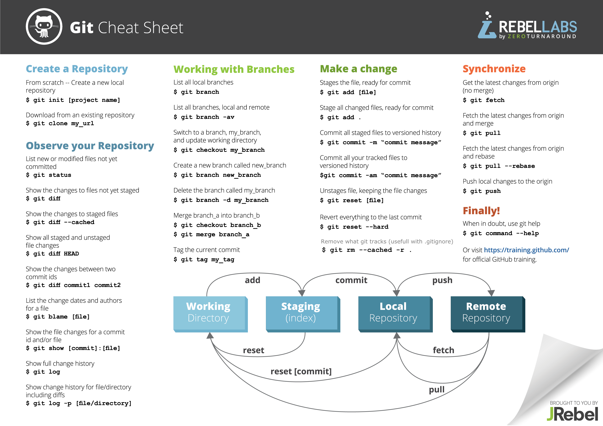

#GIT
 
## Repositories
###Start repo

- git clone (if not already an existing project) or
- `git clone --depth=1 https://github.com/angular/angular-seed.git <your-project-name>`
	- This will clone without commit history (only the last commit is cloned by --depth=1)
- git push -u origin <branch name>

###Github example:
####create a new repository on the command line
```
git init
git add .
git commit -m "first commit"
git remote add origin https://github.com/CphBusCosSem3/week6-rest.git
git push -u origin master
```


##Branches
###Create new branches
- Branch is a pointer to a commit
- "Branch early and branch often"  
- Creating a branch just creates a new pointer to the current commit
  - `git branch <branch name>` creates a new branch by that name.
  - there should now be 2 pointers to the current commit (master and the new branch)
  - `git branch` shows what branches there are
  - the asterisk (*) before the name of one branch tells which one is active.
  - making a new commit will move HEAD of the active branch
  - `git checkout <branch name>` changes current branch
  - `git checkout -b <branch name>` creates and checks out the new branch  

branches are easy to move around and often refer to different commits as work is completed on them. Branches are easily mutated, often temporary, and always changing  


###Merging
- `git merge <branch name>` merges <branch name> branch into current branch


###Rebase
- To get a straight commit history
  - As if the work done in the 2 branches were done sequentially (not in parallel)
  - `git rebase <branch name>` means our current branch will have all its unique commits copied onto the <branch name> branch
    - the original commits still exist for some time but without a reference to them (no pointer)
  - `git checkout <branch name>` and `git rebase <original branch name>` Now ensures that both branches are updated and pointing to the same commit end point
  - `git rebase <branch1> <branch2>` add (copies) all commits from <branch2> onto <branch1> and attaches head to <branch2> 
  - `git rebase <b1> <b2>` if <b2> is an ancestor to <b1> then there is no need to copy any commits to <b1> from <b2> instead <b2> will just point to <b1> and HEAD will be on <b2>


###Head
- HEAD is the currently checkedout commit
- Normally Head points to a branch name
- Detaching HEAD
	- Means to checkout a commit (instead of a branch)
	- `checkout <commit hash>` This detaches HEAD from the branch to the specific commit
- Relative refs:
	- One commit up: `^`
	- `Master^` Means the first parent of Master
	- `<branch name>^^` Means grand parent of that specific branch.
	- `git checkout HEAD^^` means: 'go back twice up through the commit tree'.
	- `git checkout HEAD~4` means: 'go back 4 times from current commit.'
- Moving a branch to another commit:
	- `git branch -f master HEAD~3` means to move the master branch back to the commit 3 commits previous
		- This just means that the pointer: 'Master' now points to that previous commit
		- (To move HEAD just use `git checkout`)
- Reverting changes
	- `git reset <commit hash>/or relative ref`
		- This just moves the current branch to a previous commit - Like rewriting history (the later commits then never really happend).
		- `git reset HEAD~4` Moves the current branch back 4 commits ago.
		- This works well locally on your own computer
		- Does not work on a shared repo/ remote branch - where other people are working on the later commits
	- `git revert <commit hash>`
		- This makes a copy of the specified commit and puts it after the last commit and then attaches the current branch to this new commit. In this way the repos content is reverted to the previous commit without loosing any history.
- Copy a number of commits to the current branch
	- `git cherry-pick <commit hash> <commit hash>` This copies the specified commits to the current branch and moves the head to the last of the commits.
	- The commits that are copied can be from different branches
- Change the commit history
	- Interactive rebase means opening an editor to rearrange and remove commits
	- `git rebase -i HEAD~4` opens up the last 4 commits for rearranging. Either change the order or 'pick' commits which will remove them from the list of commits that then will be copied on to the last commit (before the 4 that were chosen for change) and the current branch will point to the last of the copied commits.
- Cherry-pick example
	- `git checkout master` which is parent to the develop branch
	- `git cherry-pick C2` which is a commit further up the line in the development branch
	- `git commit --amend` changes the current commit (C2)
	- `git cherry-pick C3` the last commit in the development branch
	- So now master is pointing to the development branch (merged) and C2 was changed with some content


### Tags
- How to create a permanent pointer to a specific commit (like a prototype or release version etc.)
- `git tag <tagname> <commit hash>` This add a tag to a specific Commit to emphasize a milestone or importent version to be able to find it again.
- `git checkout <tagname>` This will now checkout the commit with that tag (and put os in Detached HEAD state)
